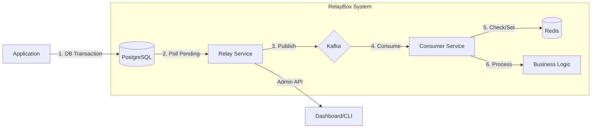

# 📦 RelayBox

RelayBox implements the **Transactional Outbox Pattern**. It ensures DB state and Kafka events always stay in sync. No more "Dual Write" bugs where a DB update succeeds but the event publish fails.

## 🎯 The Problem
In distributed systems, updating a database and sending a message to Kafka in one go is risky. If Kafka is down or the network fails, the DB transaction commits but the event is lost → **Data Drift**.

## 🚀 The Solution
RelayBox solves this by treating the DB as the source of truth for events:
1. **Atomic Save**: App saves business data and event to the `outbox` table in one DB transaction.
2. **Reliable Relay**: `Relay Service` polls the `outbox`, publishes to Kafka, then marks events as processed.
3. **Guaranteed Delivery**: If publish fails, Relay retries with bounded retry logic.
4. **Idempotent Processing**: `Consumer` uses Redis to ensure events are processed exactly once, even if Kafka delivers duplicates.



## ✨ Key Features
- **No Data Loss**: Events are never lost; they wait in the DB until Kafka accepts them.
- **Strong Consistency**: DB state and events move together.
- **Idempotency Guard**: Built-in Redis check prevents duplicate side-effects.
- **Bounded Retries**: Failed events are retried up to a configurable max before being moved to the DLQ.
- **Production Observability**: Prometheus metrics + Grafana dashboard for lag and throughput tracking.
- **Admin Auth**: Bearer token authentication on admin endpoints.

## 🛠 Getting Started

### Prerequisites
- [Docker & Docker Compose](https://docs.docker.com/get-docker/)
- [Go 1.26+](https://go.dev/dl/)

### Quick Start
```bash
git clone https://github.com/s4rvessh04/RelayBox.git
cd RelayBox
docker-compose up -d
```

> **Note:** Migrations are applied automatically via the Postgres init container on first start.

### Manual Development
1. **Infra**: `docker-compose up -d postgres kafka zookeeper redis`
2. **Run Migrations**: `psql $DB_URL -f migrations/001_outbox.sql -f migrations/002_dlq.sql`
3. **Relay**: `go build -o relay ./cmd/relay && ./relay`
4. **Consumer**: `go build -o consumer ./cmd/consumer && ./consumer`

### Environment Variables
| Variable | Default (dev) | Description |
| :--- | :--- | :--- |
| `DB_URL` | _required in prod_ | PostgreSQL connection string |
| `KAFKA_BROKERS` | `localhost:29092` | Kafka bootstrap servers |
| `REDIS_URL` | `localhost:6379` | Redis address |
| `ADMIN_TOKEN` | _(empty = no auth)_ | Bearer token for admin API |
| `RELAY_ENV` | `development` | Set to `production` to require env vars |

## 🔌 Admin API

> **Auth:** Set the `ADMIN_TOKEN` env var to enable Bearer token auth on admin endpoints.

| Endpoint | Method | Description |
| :--- | :--- | :--- |
| `/health` | `GET` | Health status of relay and deps |
| `/metrics` | `GET` | Prometheus metrics (throughput/lag) |
| `/replay` | `POST` | Reset `FAILED` events → `PENDING` |

## 📊 Monitoring
Import `grafana-dashboard.json` to track:
- **DB Lag**: `relay_pending_events_count` (High = Relay slow)
- **Throughput**: `relay_events_published_total`
- **Duplicates**: `consumer_idempotency_skips_total` (High = Kafka re-delivery)

---
MIT License.
