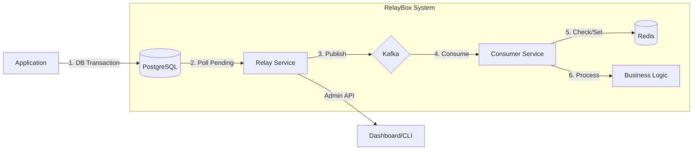

# 📦 RelayBox

RelayBox implement **Transactional Outbox Pattern**. Ensure DB state and Kafka events always stay sync. No more "Dual Write" bugs where DB update succeed but event publish fail.

## 🎯 The Problem
In distributed systems, updating a database and sending a message to Kafka in one go is risky. If Kafka is down or network fail, DB transaction commit but event lost $\to$ **Data Drift**.

## 🚀 The Solution
RelayBox solve this by treating the DB as the source of truth for events:
1. **Atomic Save**: App save business data and event to `outbox` table in one DB transaction.
2. **Reliable Relay**: `Relay Service` poll `outbox`, publish to Kafka, then mark as processed.
3. **Guaranteed Delivery**: If publish fail, Relay retry until success.
4. **Idempotent Processing**: `Consumer` use Redis to ensure event processed exactly once, even if Kafka deliver duplicate.



## ✨ Key Features
- **No Data Loss**: Events never lost; they wait in DB until Kafka accept.
- **Strong Consistency**: DB state and events move together.
- **Idempotency Guard**: Built-in Redis check prevent duplicate side-effects.
- **Production Observability**: Prometheus metrics + Grafana dashboard for lag and throughput tracking.

## 🛠 Getting Started

### Prerequisites
- [Docker & Docker Compose](https://docs.docker.com/get-docker/)
- [Go 1.21+](https://go.dev/dl/)

### Quick Start
```bash
git clone https://github.com/yourusername/relaybox.git
cd relaybox
docker-compose up -d
```

### Manual Development
1. **Infra**: `docker-compose up -d postgres kafka zookeeper redis`
2. **Relay**: `go build -o relay ./cmd/relay && ./relay`
3. **Consumer**: `go build -o consumer ./cmd/consumer && ./consumer`

## 🔌 Admin API
| Endpoint | Method | Description |
| :--- | :--- | :--- |
| `/health` | `GET` | Health status of relay and deps |
| `/metrics` | `GET` | Prometheus metrics (throughput/lag) |
| `/replay` | `POST` | Reset `FAILED` events $\to$ `PENDING` |

## 📊 Monitoring
Import `grafana-dashboard.json` to track:
- **DB Lag**: `relay_pending_events_count` (High = Relay slow)
- **Throughput**: `relay_events_published_total`
- **Duplicates**: `consumer_idempotency_skips_total` (High = Kafka re-delivery)

---
MIT License.
